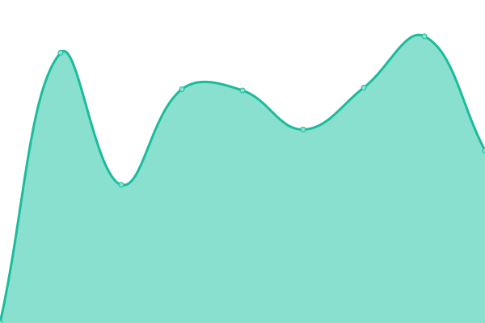
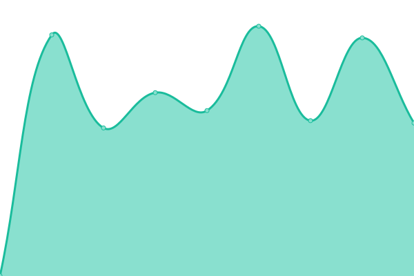
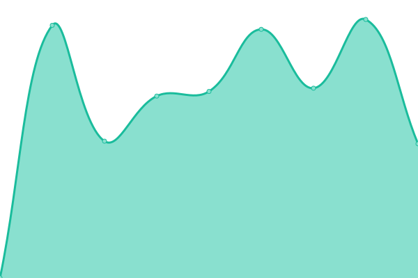
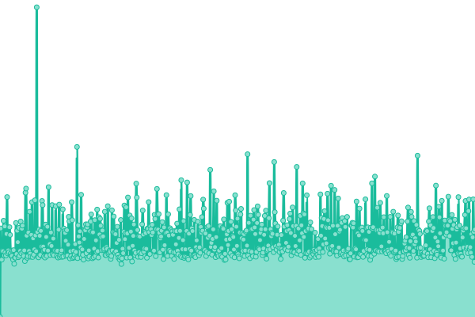

# [📈 Live Status](https://demo.upptime.js.org): <!--live status--> **🟧 Partial outage**

This repository contains the open-source uptime monitor and status page for [Valecha24](https://demo.upptime.js.org), powered by [Upptime](https://github.com/upptime/upptime).

With [Upptime](https://upptime.js.org), you can get your own unlimited and free uptime monitor and status page, powered entirely by a GitHub repository. We use [Issues](https://github.com/Valecha24/WebMonitoring/issues) as incident reports, [Actions](https://github.com/Valecha24/WebMonitoring/actions) as uptime monitors, and [Pages](https://demo.upptime.js.org) for the status page.

<!--start: status pages-->
<!-- This summary is generated by Upptime (https://github.com/upptime/upptime) -->
<!-- Do not edit this manually, your changes will be overwritten -->
<!-- prettier-ignore -->
| URL | Status | History | Response Time | Uptime |
| --- | ------ | ------- | ------------- | ------ |
|  [Coworking-Gräfrath](https://coworking-graefrath.de/) | 🟩 Up | [coworking-graefrath.yml](https://github.com/Valecha24/WebMonitoring/commits/HEAD/history/coworking-graefrath.yml) | 

 1693ms
     
 | 

<a href="https://Valecha24.github.io/WebMonitoring/history/coworking-graefrath">100.00%</a>
    

|  [Coworking-Solingen](https://coworking-solingen.com/) | 🟩 Up | [coworking-solingen.yml](https://github.com/Valecha24/WebMonitoring/commits/HEAD/history/coworking-solingen.yml) | 

 759ms
     
 | 

<a href="https://Valecha24.github.io/WebMonitoring/history/coworking-solingen">100.00%</a>
    

|  [Marketing Desk](https://marketing-desk.de/) | 🟩 Up | [marketing-desk.yml](https://github.com/Valecha24/WebMonitoring/commits/HEAD/history/marketing-desk.yml) | 

 2049ms
     
 | 

<a href="https://Valecha24.github.io/WebMonitoring/history/marketing-desk">99.79%</a>
    

|  [ProduktDatenFabrik](https://produktdatenfabrik.de/) | 🟩 Up | [produkt-daten-fabrik.yml](https://github.com/Valecha24/WebMonitoring/commits/HEAD/history/produkt-daten-fabrik.yml) | 

 1093ms
     
 | 

<a href="https://Valecha24.github.io/WebMonitoring/history/produkt-daten-fabrik">100.00%</a>
    

|  [b2b MarketingServices](https://b2b-marketingservices.de/) | 🟥 Down | [b2b-marketing-services.yml](https://github.com/Valecha24/WebMonitoring/commits/HEAD/history/b2b-marketing-services.yml) | 

 1730ms
     
 | 

<a href="https://Valecha24.github.io/WebMonitoring/history/b2b-marketing-services">69.78%</a>
    

|  [b2b MarketingServices](https://b2b-marketingservices.de/) | 🟥 Down | [b2b-marketing-services.yml](https://github.com/Valecha24/WebMonitoring/commits/HEAD/history/b2b-marketing-services.yml) | 

 1730ms
     
 | 

<a href="https://Valecha24.github.io/WebMonitoring/history/b2b-marketing-services">69.77%</a>
    

<!--end: status pages-->

[**Visit our status website →**](https://demo.upptime.js.org)

## 📄 License

- Powered by: [Upptime](https://github.com/upptime/upptime)
- Code: [MIT](./LICENSE) © [Anand Chowdhary](https://anandchowdhary.com), supported by [Pabio](https://pabio.com)
- Data in the `./history` directory: [Open Database License](https://opendatacommons.org/licenses/odbl/1-0/)
